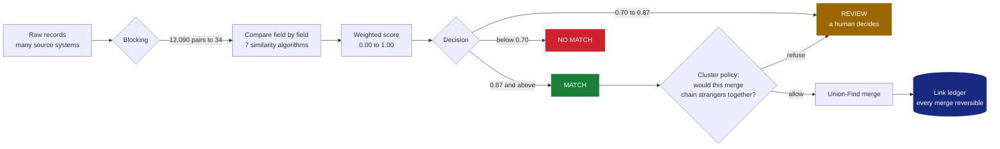
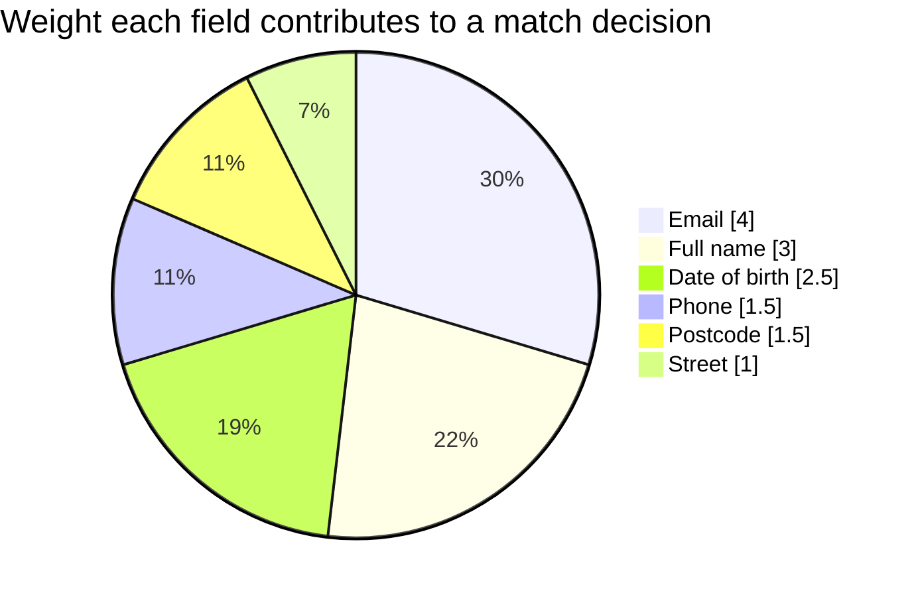

<div align="center">


<a href="https://linkedin.com/in/saksham-mathur0209">
  
</a>
<a href="mailto:sakshammathur429@gmail.com">
  
</a>
<a href="https://github.com/Saksham0902/coalesce">
  
</a>

<br/><br/>


</div>

---

## About

I'm a software engineer with **4+ years at Salesforce**, building backend services, data pipelines
and marketing-automation tooling for enterprise campaign teams.

The problems I enjoy most are the ones where the data refuses to cooperate — records that describe
the same person but agree on nothing, fields that are missing rather than wrong, and systems that
have to make a confident decision anyway and then explain themselves afterwards.

I care a lot about **saying what a system cannot do**. Every project below ships with its
limitations written down next to its results.

```java
public record Engineer(String role, String company, int years) {

    static Engineer me() {
        return new Engineer("Software Engineer", "Salesforce", 4);
    }

    List<String> currentlyBuilding() {
        return List.of(
            "Coalesce — entity resolution: deciding when two records are the same person",
            "Email Preflight — catching broken marketing emails before they send"
        );
    }

    Set<String> believesIn() {
        return Set.of(
            "a domain layer with no framework imports",
            "three-way decisions: yes, no, and ask a human",
            "tests that explain intent, not just raise coverage",
            "documented limitations over quiet ones"
        );
    }
}
```

---

## Featured — Coalesce

> **[`Saksham0902/coalesce`](https://github.com/Saksham0902/coalesce)** · Java 21 · Spring Boot · ported to Apex

Three hospital systems hold a record for the same patient. No shared ID, and every single field is
written differently:

| Source | Name | DOB | Postcode |
| :--- | :--- | :--- | :--- |
| EMR | Jonathan Smith | 1985-03-02 | SW1A 1AA |
| Lab | Jon Smith | 1985-03-02 | SW1A 1AA |
| Claims | J. Smyth | 02/03/1985 | SW1A1AA |

A human sees one person instantly. `=` sees three. **Coalesce closes that gap** — and shows its
working for every decision it makes.



<table>
<tr>
<td width="50%" valign="top">

**Measured, not claimed**

| | |
| :--- | ---: |
| Pairwise precision | **1.000** |
| Pairwise recall | **0.919** |
| Pairwise F1 | **0.958** |
| Cluster-level F1 | **0.903** |
| Blocking reduction | **355×** |

<sub>95-record labelled fixture, 45 true entities.<br/>Reproduce with `mvn -q compile exec:java`.</sub>

</td>
<td width="50%" valign="top">

**The three hard parts**

**Missing ≠ different.** A blank phone number is not evidence of two people. Scores renormalise
over only the fields both records actually have.

**Similarity isn't transitive.** Jon → John → Smyth → Joan is four believable steps between two
strangers. A cluster policy samples across the boundary before merging.

**Merges must be undoable.** Storing `cluster_id` throws the evidence away. Coalesce stores the
links and derives the clusters.

</td>
</tr>
</table>

<details>
<summary><b>Why it also runs inside Salesforce</b></summary>

<br/>

The domain layer has zero framework imports — no Spring, no persistence, no web. That constraint
looked academic until it paid for itself: Salesforce can't run Java, but because the matching rules
were plain logic rather than framework-entangled code, the same rules were **ported to Apex** and
now run natively on-platform.

- 4 Apex classes + 2 Lightning Web Components
- 22 tests at 93% coverage
- Duplicates surfaced on a record page in **171 ms**
- Blocking cuts a full-org scan from 4,087 ms to **51 ms**, finding identical clusters

</details>

---

## Also building

<table>
<tr>
<td width="50%" valign="top">

### Email Preflight
<sub>JavaScript · Lightning Web Components · Jest · <i>private repo</i></sub>

Marketing Cloud Engagement validated emails before send. Marketing Cloud Next doesn't — so broken
emails ship, and you find out by reading engagement data afterwards.

A **read-only** sidebar panel that runs **77 checks across 20 categories** the moment it opens:
broken merge fields, missing unsubscribe links, images with no alt text, Outlook layout breakage,
Gmail clipping.

Read-only is the whole design: it cannot edit your content and cannot block a send. The worst case
is a wrong report, never a damaged email.

**Now used by ~80% of our marketing projects.**

</td>
<td width="50%" valign="top">

### UTM Link Manager
<sub>JavaScript · Apex · 96 Jest + 12 Apex tests</sub>

Adds, updates and removes campaign tracking parameters across every link in an email.

The interesting property is **idempotency** — run it twice and you get the same result as running
it once. The naive version appends on every pass, so a second run leaves you with
`?utm_source=email&utm_source=email` and a third makes it worse.

It detects tags already present and rewrites them in place.

</td>
</tr>
</table>

---

## Tech

<div align="center">

**Languages**


**Backend & Data**


**Platform & Tooling**


</div>

---

## By the numbers

<div align="center">


</div>

Most of what I've built lives behind Salesforce's firewall, so this profile is a sample rather than
a record. The numbers above come from work I can point at and reproduce.

### How Coalesce weighs a match

Not every field carries the same evidence. Two people sharing a street are unremarkable; two people
sharing an email address are almost certainly one person. These are the actual weights from the
Contact schema:



A match needs agreement worth **at least 35% of the available weight across 2+ fields**, so a lone
matching street can never carry a decision on its own.

---

<details>
<summary><b>Where I started</b> — university projects, kept on purpose</summary>

<br/>

I've left these public rather than tidying them away. They're four years older than the work above,
and the gap between them is the point.

| Project | What it was |
| :--- | :--- |
| [**UniSHARE**](https://github.com/Saksham0902/UniSHARE) | Android app for sharing course material and educational resources — Kotlin |
| [**A\* Path Finding Visualization**](https://github.com/Saksham0902/A-Path-Finding-Visualization) | Pick a start and end, watch A\* search for the shortest path — Python |
| [**CodePlay**](https://github.com/Saksham0902/CodePlay) | An online coding platform |
| [**Machine Learning Projects**](https://github.com/Saksham0902/Machine-Learning-Projects) | Mini ML projects in Jupyter notebooks |
| [**100 Days of Code**](https://github.com/Saksham0902/100-days-of-code) | Coding (almost) every day for 100 days |

</details>

---

<div align="center">

### Let's talk

I'm happy to go deep on entity resolution, Salesforce platform architecture, or why your
similarity score should never be a boolean.

<a href="https://linkedin.com/in/saksham-mathur0209">
  
</a>
<a href="mailto:sakshammathur429@gmail.com">
  
</a>


</div>
